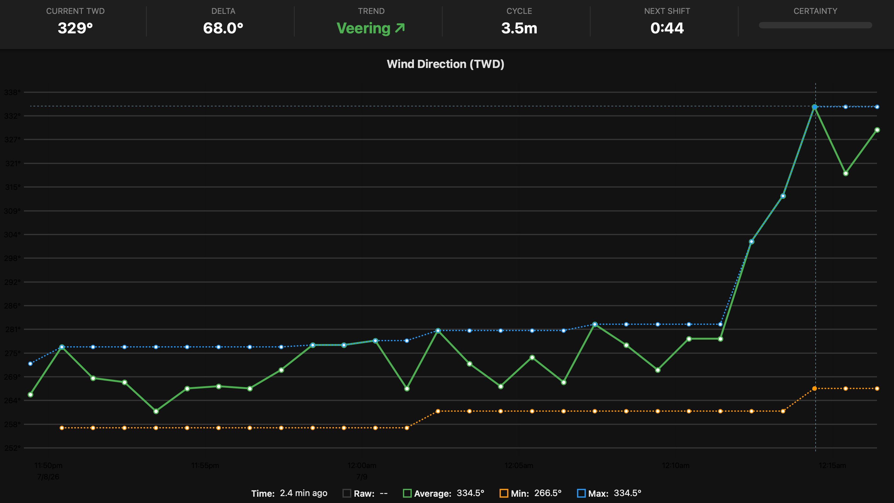

# signalk-windshift

A SignalK plugin that analyzes True Wind Direction (TWD) to detect, quantify
and **predict wind shifts** — for tactical sailing, race preparation and
plain curiosity about what the wind is doing.

Originally created by [Johan Wallinder](https://github.com/jwallinder/signalk-windshift),
extended in this fork with cycle prediction, tack awareness, multi-station
tracking and a live dashboard.

---

## What we are trying to achieve

Wind is rarely steady. On most race days the True Wind Direction oscillates
around a mean — backing and veering in a semi-regular rhythm driven by
thermals, gradient interplay and terrain. A boat that tacks in phase with
those oscillations gains hugely on one that ignores them. The tactical
questions are always the same:

1. **How big are the shifts?** (the spread between min and max TWD)
2. **How often do they come?** (the oscillation period)
3. **Which phase are we in right now?** (lifted or headed, veering or backing)
4. **When is the next shift due?** (the countdown that decides "tack now or hold")

Raw masthead data doesn't answer any of this directly — it looks like the
green noise below. The underlying rhythm (hand-marked in red) is what we
want the plugin to extract automatically:


*Raw TWD (green) with the underlying oscillation traced by hand — the plugin's
job is to find this rhythm without the hand.*


*The same idea with the oscillation envelope marked: spread, period and phase
are the tactical currency.*

The second ambition is **pre-race preparation**: hours (or a day) before the
start, monitor the wind behavior at several weather stations around the
racecourse — is the oscillation local or course-wide, is there a gradient
between the inshore and offshore stations, what period should we expect where
we'll be sailing? With the multi-station feature and data from
[Sjöfartsverket ViVa](https://github.com/theseal666/signalk-viva-plugin),
that picture builds itself while the boat is still at the dock.

## How we do it

### Smoothing

Raw TWD samples are collected into a short buffer (default 10 s) and reduced
to one averaged data point using a proper *circular* mean (sin/cos
components), so a wind oscillating around north doesn't produce nonsense.
These averaged points form the time series everything else is computed from.

### Shift detection (zigzag with threshold)

The averaged TWD is *unwrapped* into a continuous series (no 0°/360° jumps)
and run through a zigzag detector: while the wind veers, the running maximum
is tracked as a candidate peak; only when the wind has come **back** by at
least the shift threshold (default 4°) is that candidate confirmed as a real
peak, and the detector flips to hunting a trough. Wiggles smaller than the
threshold never register — sensor noise cannot flood the statistics.
Confirmed extremes are timestamped at the actual turning point, not at the
moment of confirmation.

### Cycle period, certainty and prediction

The cycle period is the average interval between consecutive peaks and
between consecutive troughs (one full oscillation). **Certainty** measures
how regular those intervals are: metronomic shifts score near 1.0, chaos
scores 0 — and a low score is the honest answer in unstable conditions, not
a malfunction. Because peaks and troughs alternate, the next extreme is
expected about **half a cycle** after the last one; `timeToNextShift` counts
down live from there. Old extremes expire so a shift from hours ago cannot
skew the estimate.

### Tack awareness (boat source only)

Two triggers pause data collection during maneuvers (the "don't chase your
own tacks" filter): a heading change of more than ~11°, and the apparent
wind angle crossing sides. AWA samples within ~3° of head-to-wind or beyond
~165° are ignored, since the AWA sign is pure noise there. Shore stations
skip all of this — a lighthouse doesn't tack.

### Auto-calibration

A misaligned wind sensor reads systematically different TWD on port vs
starboard tack. The plugin keeps recent raw readings per tack, takes the
circular mean of each side, and applies **half the difference per tack** —
pulling both toward the common mean (a single global offset can never fix a
side-to-side asymmetry). The means are computed from uncorrected data so the
correction never feeds back into its own estimate. Caveat: if you tack *on*
the shifts, genuine oscillation shows up as a port/starboard difference and
gets partially calibrated away — leave this off unless you suspect sensor
misalignment.

### Multi-station tracking

With [signalk-viva](https://github.com/theseal666/signalk-viva-plugin)
installed and **Track ViVa stations** set to N, the plugin runs an
independent analyzer for each of the N nearest stations, in parallel with
the boat. Stations self-discover from whatever viva publishes (no path
configuration) and are re-ranked by distance every poll, so the active set
follows the boat if it moves mid-race. Station results publish under
`environment.observations.viva.<station>.windshift.*`; the boat stays on
`environment.wind.windshift.*`.

### Dashboard

The built-in webapp shows a tactical metrics bar (average wind speed / gust,
TWD, delta, trend, cycle, next-shift countdown, certainty gauge) over a
"waterfall" chart of raw TWD, smoothed TWD, the min/max envelope, and wind
speed + gust on a right-side knots axis. A **Source** dropdown switches
between the boat and the tracked stations — every source is analyzed
continuously in the background, so switching is instant: the chart seeds from
server-side history and the metrics bar fills from the latest snapshot.
Station views overlay the boat's smoothed TWD as a purple reference line, so
a station and the boat can be compared directly on one chart. Cursor readouts
are in compass degrees (direction) or knots (speed), and "minutes ago" on the
time axis.

The "Avg Wind" header value is a 2-minute rolling average of received wind
speed samples, smoothing out short-term noise. Gust is the instrument's own
reported gust value — for ViVa shore stations this maps to *Byvind*; for the
boat it requires a gust sensor mapped to `environment.wind.gust` in the
instrument configuration.

## Current state (July 2026)

**Branches:**
- `main` — v0.0.6: single-source analysis, stable.
- `feature/multi-station` — v0.3.0: everything described above; running on
  the test boat now. Will be merged to main after the soak test.

**Live soak test:** the plugin currently runs 24/7 on a Raspberry Pi,
analyzing the Vinga lighthouse TWD as its "boat" source (the boat is at the
mooring, so shore data stands in for the masthead) plus the five nearest
ViVa stations on the Bohuslän coast, polled every 30 s. First results:
cycle detection locks onto real oscillations within the hour, and the
certainty score correctly stays low in irregular morning breeze.

**Persistence:** each source's 24 h metrics history is saved to disk (the
plugin data directory, `windshift-history.json`) every 5 minutes and on
shutdown, and restored on startup — so the waterfall survives server
restarts. Deeper analyzer state (cycle statistics, calibration) is
deliberately not persisted; it rebuilds from live data within ~half an hour.

**Known limitations / roadmap:**
- Cycle metrics need a few completed ≥4° swings before they wake up —
  expect zeros for the first half hour in light or steady air, and after
  a server restart.
- The dashboard's grey "Raw" line only draws for sources that publish a raw
  TWD stream (stations do; the boat does when its instruments are live).
- **Chart time-axis zoom** — drag to select a time window, double-click or
  a "Reset zoom" button to return to the full view. uPlot supports this
  natively; the current code disables it (`setScale: false`) pending a clean
  UX for the reset affordance.
- Not yet published to npm (install from GitHub, see below).
- Next up: forecast verification as a fully independent companion plugin
  ([signalk-forecast-skill](https://github.com/theseal666/signalk-forecast-skill)) —
  scoring weather models against these observations.

## Screenshots

### Dashboard with multi-station dropdown

*Flipping between the boat and five ViVa stations (distances shown). Each
source keeps its own analysis, history and metrics.*

### Metrics bar in action

*A detected 3.5-minute cycle with the next shift predicted in 44 seconds,
during a 68° spread — the certainty gauge stays humble about it.*

### Plugin configuration

*Current settings during the soak test: shore-station source path, maneuvers
ignored (boat swings at the mooring), five stations tracked. The status line
at the top shows live per-source analysis point counts.*

### Historical analysis in Grafana

*Long-term view: raw data (green) inside the emitted min/max envelope
(blue/orange).*

## SignalK Paths

Boat analysis (always on):

| Path | Description | Unit |
| :--- | :--- | :--- |
| `environment.wind.windshift.avg` | Smoothed True Wind Direction | rad |
| `environment.wind.windshift.min` | Minimum TWD in the tracking period | rad |
| `environment.wind.windshift.max` | Maximum TWD in the tracking period | rad |
| `environment.wind.windshift.delta` | Spread between max and min | rad |
| `environment.wind.windshift.cyclePeriod` | Average time between wind shifts (full cycle) | s |
| `environment.wind.windshift.timeToNextShift` | Estimated time to next predicted shift | s |
| `environment.wind.windshift.certainty` | Confidence score (0.0 - 1.0) | - |
| `environment.wind.windshift.trend` | 1 (Veering), -1 (Backing), 0 (Steady) | - |
| `environment.wind.windshift.calibrationOffset` | Half the measured port/starboard difference | rad |
| `environment.wind.windshift.isSettled` | 1 if boat is settled, 0 during tack lockout | - |

Station analysis (when Track ViVa Stations > 0): the same metrics under
`environment.observations.viva.<station>.windshift.*`.

Note: `min` and `max` are kept continuous with the tracking window (they may
fall slightly outside 0–2π when the wind straddles north) so charting tools
can draw them without wrap artifacts.

## Configuration

- **TWD Buffer Time**: How long to average TWD to smooth out noise (seconds).
- **Min/Max Calculation Time**: The window of time to keep data for calculating spread (minutes).
- **Shift Detection Threshold**: How far the wind must swing back before an extreme counts as a shift (degrees, default 4).
- **Dynamic Window**: Auto-tune tracking period based on detected cycle.
- **Auto-Calibrate**: Detect and correct for tack-induced errors by comparing Port vs Starboard means.
- **Tack Lockout Time**: Seconds to ignore data after a maneuver (default 60s).
- **TWD Source Path**: Which SignalK path to analyze (default `environment.wind.directionTrue`).
- **Ignore Maneuvers**: Skip heading/AWA tack detection entirely.
- **Track ViVa Stations**: Number of nearest shore stations to analyze in parallel (0 = off).

## Testing against a shore station

For soak testing without going sailing, point the "boat" analysis at a
nearby weather station instead of the masthead:

- **TWD Source Path**: `environment.observations.viva.vinga.wind.directionTrue`
- **Ignore Maneuvers**: on — otherwise the boat swinging at the mooring with
  wind and current keeps triggering the maneuver lockout, even though the
  station's TWD is unaffected by what the hull is doing.

Station data arrives at polling rate (30–60 s), so expect one analyzed point
every minute or two: coarse but plenty for verifying cycle detection,
prediction and long-run stability over days.

## HTTP endpoints

Served by the plugin (require a logged-in session):

- `/plugins/windshift/sources` — available sources for the dashboard dropdown
- `/plugins/windshift/history?source=<id>` — 24 h metrics history per source
- `/plugins/windshift/latest?source=<id>` — latest metrics snapshot per source

## Installation

Multi-station version (this branch):

```bash
cd ~/.signalk
npm install "https://github.com/theseal666/signalk-windshift.git#feature/multi-station"
sudo systemctl restart signalk
```

Stable single-source version: same command without the `#feature/multi-station`.

## Accessing the Dashboard

Once the plugin is installed and started:
`http://<your-signalk-ip>/@jwallinder/windshift`

---
*Experimental and under active development — currently in a multi-day live
soak test against Swedish west coast weather stations.*
